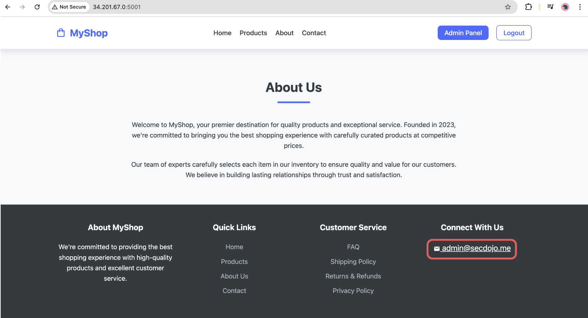
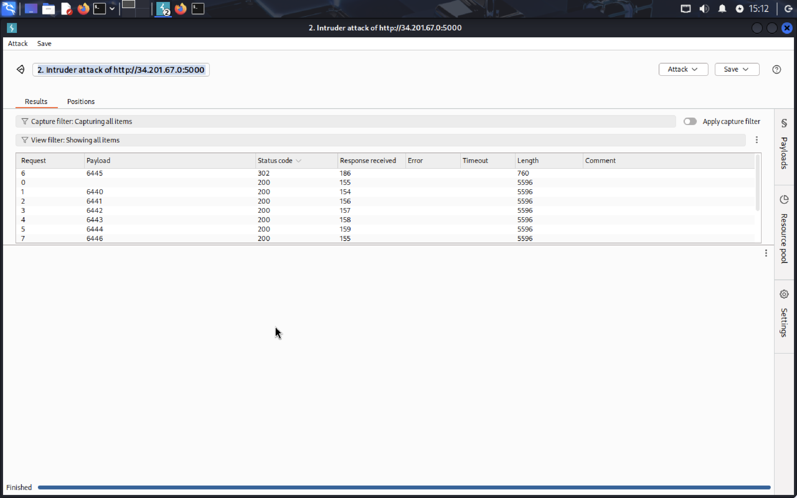
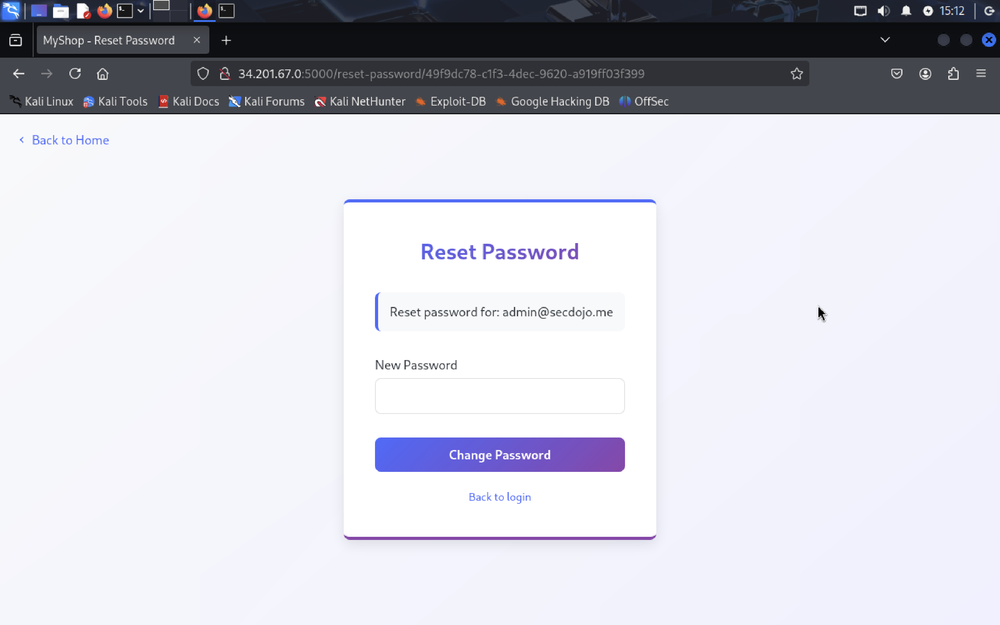
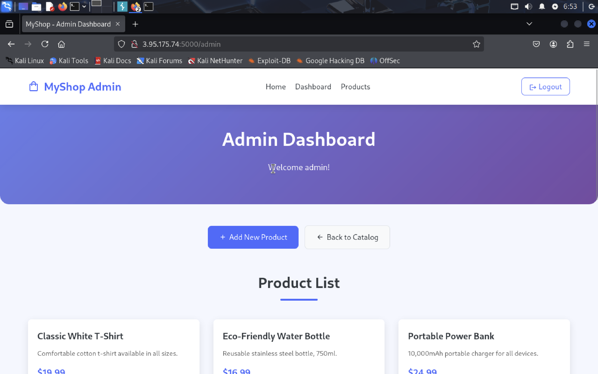
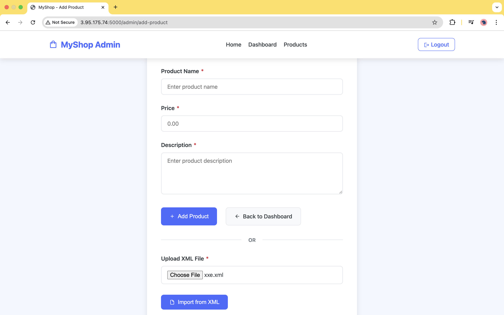
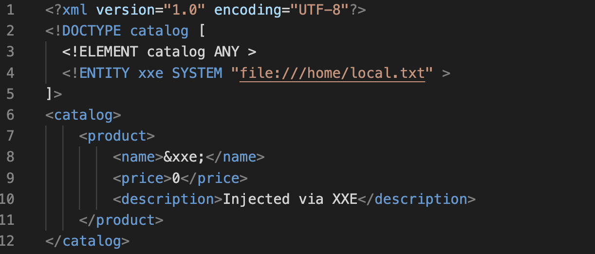
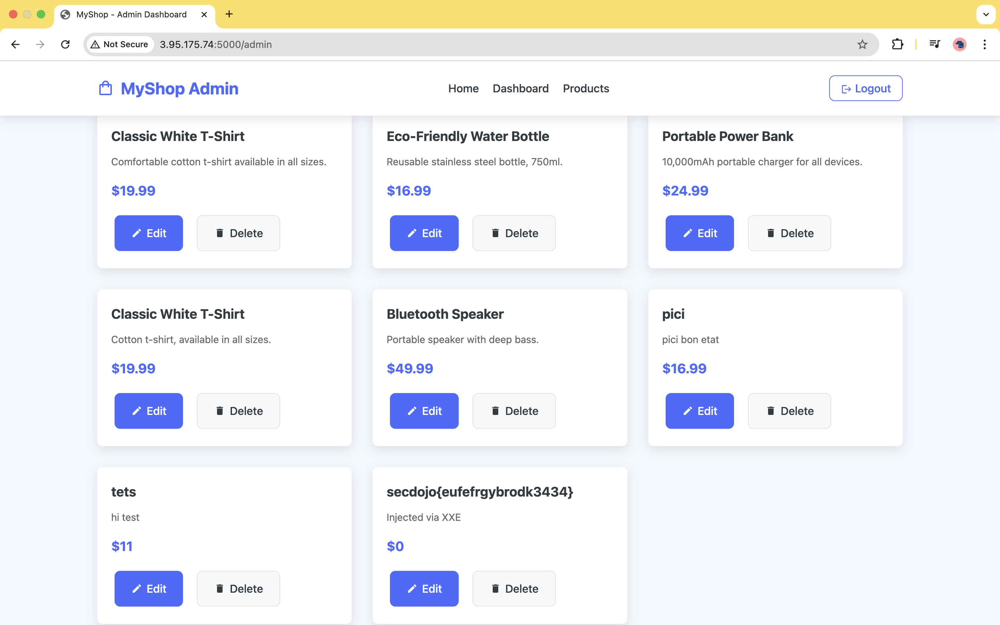

# MyShop CTF - Solution Walkthrough

This document provides detailed explanations and solving steps for each AppSec challenge question in the **MyShop** lab, including exploitation of OTP brute-force and xxe.

---

## Challenge Questions & Solutions

---

**1. By observing the login and account recovery form behavior, which type of attack appears feasible due to the lack of abuse protection?**  
- **Answer:** `c) Brute-force on a sensitive feature`  
- **Explanation:** There is no rate limiting or CAPTCHA, allowing attackers to brute-force OTP or login credentials.

---

**2. What flaw in the OTP verification process makes brute-forcing possible?**  
- **Answer:** `b) No captcha or delay is enforced between attempts`  
- **Explanation:** Repeated attempts are possible without delay, making brute-force viable.

---

**3. What is the admin's email address discovered during the test?**  
- **Answer:** `admin@secdojo.me`  
- **Explanation:** This email was publicly visible in the website footer.  
  

---

**4. While testing for brute-force vulnerabilities in the OTP validation process, which Burp Suite module is best suited for automating multiple input attempts?**  
- **Answer:** `c) Intruder`  
- **Explanation:** Burp Intruder allows mass input testing with automated payloads.

After discovering the admin's email address exposed on the website, we used the forgot password functionality to trigger an OTP code sent to the admin account.

We then launched a brute-force attack against the OTP verification endpoint. By observing HTTP response codes, we identified the correct OTP value based on a 302 Found redirect response, which indicated a successful verification.
Once the correct OTP was found, we proceeded to reset the admin's password using the valid OTP.

With the new credentials, we logged in and successfully gained access to the admin panel.

---

**5. What simple protection could effectively mitigate OTP brute-force attacks?**  
- **Answer:** `b) Add a 5-second delay between attempts`  
- **Explanation:** A delay greatly reduces the feasibility of brute-force attacks.

---

**6. Which CWE classification corresponds to this brute-force vulnerability?**  
- **Answer:** `CWE-307`  
- **Explanation:** *Improper Restriction of Excessive Authentication Attempts*.

---

**7. The application reads product data from a file named `products.xml`. Which Python module is used to parse this file?**  
- **Answer:** `c) lxml.etree`  
- **Explanation:** The application uses `lxml.etree` for XML parsing, which is vulnerable to XXE if misconfigured.
#partie mn lcode

---

**8. Why can using `lxml.etree` without specific precautions be dangerous?**  
- **Answer:** `b) It allows external entities by default`  
- **Explanation:** lxml resolves external entities unless explicitly disabled, allowing XXE.

---

**9. What type of exploit becomes possible due to this behavior?**  
- **Answer:** `c) XML External Entity (XXE)`  
- **Explanation:** XXE enables attackers to read files or cause SSRF via crafted XML.

---

**10. Which typical payload can be used to read internal files via this vulnerability?**  
- **Answer:** `c) <!DOCTYPE foo [ <!ENTITY xxe SYSTEM "file:///etc/passwd"> ]>`  
- **Explanation:** This payload injects an entity pointing to a local file.

---

**11. Which CWE classification describes an XXE vulnerability?**  
- **Answer:** `CWE-611`  
- **Explanation:** *Improper Restriction of XML External Entity Reference*.

---

**12. After successfully exploiting the XXE vulnerability and reading the flag file, what flag did you discover?**  
- **Answer:** `secdojo{eufetrgybrodk3434}`  
- **Explanation:** This flag was included in a local file read through XXE.
After gaining access to the admin panel, we noticed that the application allows adding new products either manually via a form or by uploading an XML file.

This file upload functionality is vulnerable to XML External Entity (XXE) injection.
By crafting and uploading the malicious XML payload shown below, we were able to exploit this vulnerability:

The payload was designed to read sensitive files from the server—in this case, /home/local.txt.
As a result, we successfully retrieved the contents of the target file, revealing the flag:

